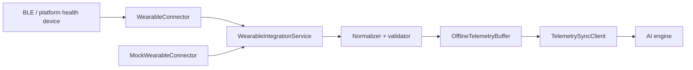

# Wearable Integration Layer

Flutter-compatible integration layer for BLE wearables, health sensors, mock telemetry, validation, offline buffering, and backend sync.

## Architecture



## Key Pieces

- `WearableConnector`: vendor-neutral contract for scan, connect, disconnect, and telemetry streams.
- `BleTransport`: boundary for native Android/iOS BLE implementations through platform channels.
- `BleHeartRateConnector`: Generic BLE Heart Rate Service connector using UUID `0x180D` and characteristic `0x2A37`.
- `PlatformSensorConnector`: platform-channel motion, inactivity, and step stream for native sensor plugins.
- `TelemetrySample`: normalized event format for heart rate, sleep duration, steps, calories, movement, inactivity, and stress.
- `DefaultTelemetryNormalizer`: enforces canonical units before validation and buffering.
- `OfflineTelemetryBuffer`: queues validated samples and safely restores batches when sync fails.
- `MockTelemetryGenerator`: deterministic synthetic wearable datasets from a seed.
- `MockWearableConnector`: hardware-free streaming connector for development and tests.

## Usage

```dart
final service = WearableIntegrationService(
  connectors: [
    MockWearableConnector(),
    BleHeartRateConnector(transport: MethodChannelBleTransport()),
    PlatformSensorConnector(),
  ],
  offlineBuffer: OfflineTelemetryBuffer(
    syncClient: MyBackendTelemetrySyncClient(),
  ),
);

final devices = await service.scan().toList();
await service.connect(devices.first);

service.telemetry.listen((sample) {
  // Forward to app state, local persistence, charts, or AI session context.
});
```

## Platform Channel Contract

`MethodChannelBleTransport` expects native Android/iOS code to expose:

- Method channel: `wearable_integration/ble_methods`
- Scan event channel: `wearable_integration/ble_scan`
- Notification event channel: `wearable_integration/ble_notifications`
- Sensor event channel: `wearable_integration/sensors`

Methods:

- `connect({ deviceId })`
- `disconnect({ deviceId })`

Scan events:

```json
{
  "id": "device-id",
  "name": "Wearable Name",
  "rssi": -58
}
```

Notification events:

```json
{
  "deviceId": "device-id",
  "serviceUuid": "0000180d-0000-1000-8000-00805f9b34fb",
  "characteristicUuid": "00002a37-0000-1000-8000-00805f9b34fb",
  "value": [0, 72],
  "timestamp": "2026-01-01T12:00:00.000Z"
}
```

Sensor events:

```json
{
  "timestamp": "2026-01-01T12:00:00.000Z",
  "movementScore": 64,
  "inactiveMinutes": 15,
  "stepCount": 4100
}
```

## Adding Vendors

Add a new class that implements `WearableConnector`, normalize vendor-specific payloads into `TelemetrySample`, then register it with `WearableIntegrationService`. The app, buffering, backend sync, and AI pipeline do not need to change.
